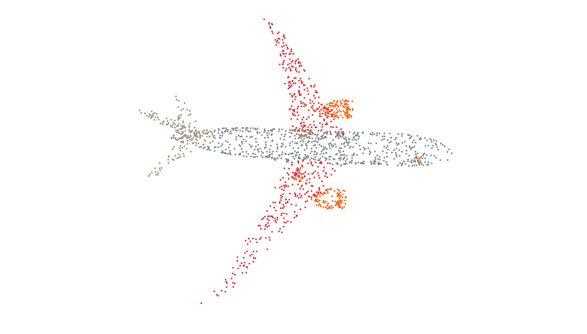

# Pointnet++ Part segmentation
This repo is implementation for [PointNet++](https://arxiv.org/abs/1706.02413) part segmentation model based on [PyTorch](https://pytorch.org) and [pytorch_geometric](https://github.com/rusty1s/pytorch_geometric). It can achieve comparable or better performance even compared with [PointCNN](https://arxiv.org/abs/1801.07791) on Shapenet dataset.

**The model has been mergered into [pytorch_geometric](https://github.com/rusty1s/pytorch_geometric) as a point cloud segmentation [example](https://github.com/rusty1s/pytorch_geometric/blob/master/examples/pointnet2_segmentation.py), you can try it.**

# Performance
Segmentation on  [A subset of shapenet](http://web.stanford.edu/~ericyi/project_page/part_annotation/index.html).

| Method | mcIoU|Airplane|Bag|Cap|Car|Chair|Earphone|Guitar|Knife|Lamp|Laptop|Motorbike|Mug|Pistol|Rocket|Skateboard|Table
| :---: | :---: | :---: | :---: | :---: | :---: | :---: | :---: | :---: | :---: | :---: | :---: | :---: | :---: | :---: | :---: | :---: | :---: | 
| PointNet++   | 81.9| 82.4| 79.0| 87.7| 77.3 |90.8| 71.8| 91.0| 85.9| 83.7| 95.3| 71.6| 94.1| 81.3| 58.7| 76.4| 82.6| 
| PointCNN     | 84.6| 84.11| **86.47**| 86.04| **80.83**| 90.62| **79.70**| 92.32| 88.44| 85.31| 96.11| **77.20**| 95.28| 84.21| 64.23| **80.00**| 82.99| 
| PointNet++(this repo) | **84.68**| **85.42**| 85.92| **88.39**| 79.73| **91.86**| 75.37| **92.95**| **88.56**| **85.72**| **97.00**| 72.94| **96.88**| **84.52**| **64.38**| 79.39| **85.91**|

mcIOU: mean per-class pIoU

All experiments are trained with default configration: npoints=2500, batchsize=8, num_epoches=25. The recorded accuracy above is just the test accuracy of the final epoch model.
# Requirements
- [PyTorch](https://pytorch.org)
- [pytorch_geometric](https://github.com/rusty1s/pytorch_geometric)
- [Open3D](https://github.com/intel-isl/Open3D)(optional, for visualization of segmentation result)

## Quickly install pytorch_geometric and Open3D with Anaconda
```
$ pip install --verbose --no-cache-dir torch-scatter
$ pip install --verbose --no-cache-dir torch-sparse
$ pip install --verbose --no-cache-dir torch-cluster
$ pip install --verbose --no-cache-dir torch-spline-conv (optional)
$ pip install torch-geometric
```

```
# optional
conda install -c open3d-admin open3d
```

# Usage
Training
```
python main.py
```

Show segmentation result
```
python vis/show_seg_res.py
```

# Sample segmentation result



# Links
-  [pointnet.pytorch](https://github.com/fxia22/pointnet.pytorch) by fxia22. This repo's tranining code is heavily borrowed from fxia22's repo.
- Official [PointNet](https://github.com/charlesq34/pointnet) and [PointNet++](https://github.com/charlesq34/pointnet2) tensorflow implementations
- [PointNet++ classification example](https://github.com/rusty1s/pytorch_geometric/blob/master/examples/pointnet%2B%2B.py) of pytorch_geometric library
